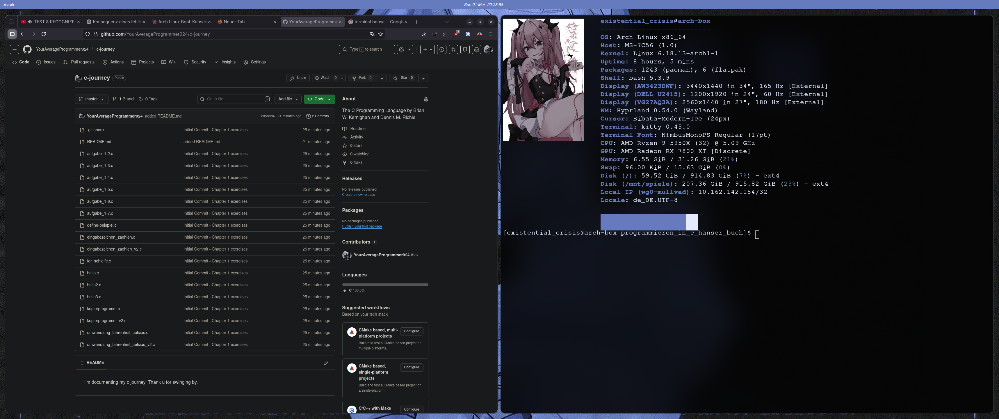
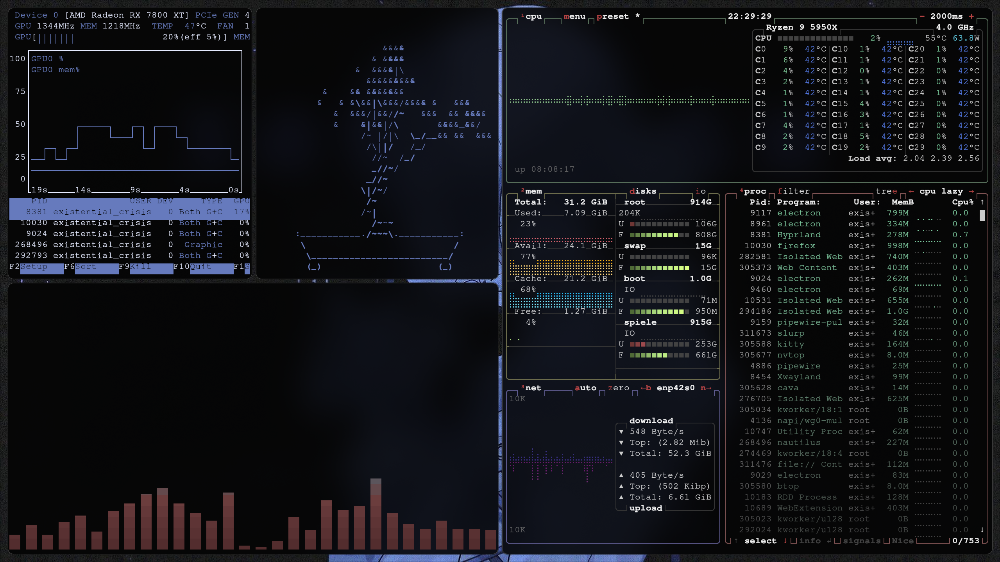

# ☆ Frosted-Indigo --- Dotfiles ☆

## ☆ Screenshots ☆

| Overview | Terminal |
|:---:|:---:|
|  |  |
| Various programs | Other |
|  |  |

## ☆ System ☆
- **WM:** Hyprland
- **Bar:** Quickshell
- **Terminal:** Kitty
- **Launcher:** wofi
- **Theme:** Frosted Indigo (Accent Color: #667bbe)
- **OS:** Arch Linux
- **Display Manager:** sddm

## Dependencies

> Minimal package set for a functioning **frosted-indigo** rice.
> Tested on Arch Linux. AUR packages require `yay` or equivalent.

---

### Core Compositor & Session

| Package | Source | Notes |
|---|---|---|
| `hyprland` | official | Compositor |
| `uwsm` | official | Wayland session manager |
| `xorg-xwayland` | official | X11 compatibility |
| `xdg-desktop-portal-hyprland` | official | Screen share, file picker |
| `xdg-desktop-portal-gtk` | official | GTK portal fallback |

### Status Bar

| Package | Source | Notes |
|---|---|---|
| `quickshell-git` | AUR | Primary bar (QML-based) |
| `qt6-base` `qt6-declarative` `qt6-svg` `qt6-wayland` | official | Quickshell runtime deps |
| `hyprland-qt-support` | official | Hyprland QML integration |

### Terminal

| Package | Source | Notes |
|---|---|---|
| `kitty` | official | Primary terminal |
| `kitty-shell-integration` | official | Shell integration |
| `kitty-terminfo` | official | Terminfo entries |

### Launcher & Notifications

| Package | Source | Notes |
|---|---|---|
| `wofi` | official | App launcher |
| `dunst` | official | Notification daemon |

### Lock Screen & Idle

| Package | Source | Notes |
|---|---|---|
| `hyprlock` | official | Lock screen |
| `hypridle` | official | Idle daemon |

### Display Manager

| Package | Source | Notes |
|---|---|---|
| `sddm` | official | Login manager |
| `sddm-theme-corners-git` | AUR | Used SDDM theme |

### Audio

| Package | Source | Notes |
|---|---|---|
| `pipewire` | official | Audio server |
| `pipewire-alsa` `pipewire-pulse` `pipewire-audio` | official | Backend support |
| `wireplumber` | official | Session manager |

### Fonts

| Package | Source | Notes |
|---|---|---|
| `ttf-jetbrains-mono-nerd` | official | Primary monospace font |
| `ttf-material-symbols-variable-git` | AUR | Icons in bar/UI |
| `noto-fonts-emoji` | official | Emoji support |

### Theming & Icons

| Package | Source | Notes |
|---|---|---|
| `hyprcursor` | official | Cursor theme support |
| `adwaita-cursors` | official | Fallback cursors |
| `adwaita-icon-theme` | official | Fallback icons |
| `gtk3` `gtk4` | official | GTK apps compatibility |
| `qt5ct` `qt6ct` | official | Qt app theming |

### Polkit

| Package | Source | Notes |
|---|---|---|
| `hyprpolkitagent` | official | Polkit agent for Hyprland |

### Screenshots

| Package | Source | Notes |
|---|---|---|
| `grim` | official | Screenshot tool |
| `slurp` | official | Region selection |

### Clipboard

| Package | Source | Notes |
|---|---|---|
| `wl-clipboard` | official | Wayland clipboard |

### Shell Prompt

| Package | Source | Notes |
|---|---|---|
| `starship` | official | Cross-shell prompt |

### Optional but recommended

| Package | Source | Notes |
|---|---|---|
| `btop` | official | System monitor |
| `cava` | official | Audio visualizer |
| `fastfetch` | official | System info fetch |
| `hypridle` | official | Already listed above |
| `brightnessctl` | official | Brightness control |
| `power-profiles-daemon` | official | CPU power profiles |
